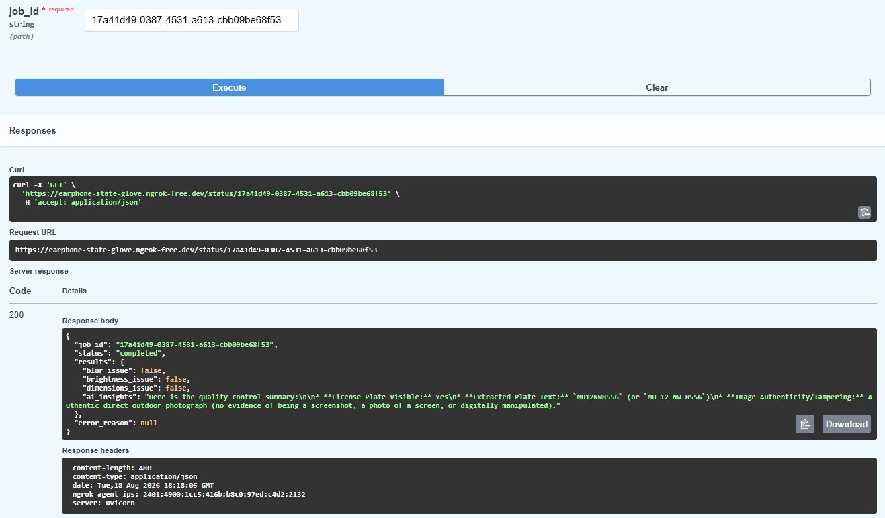
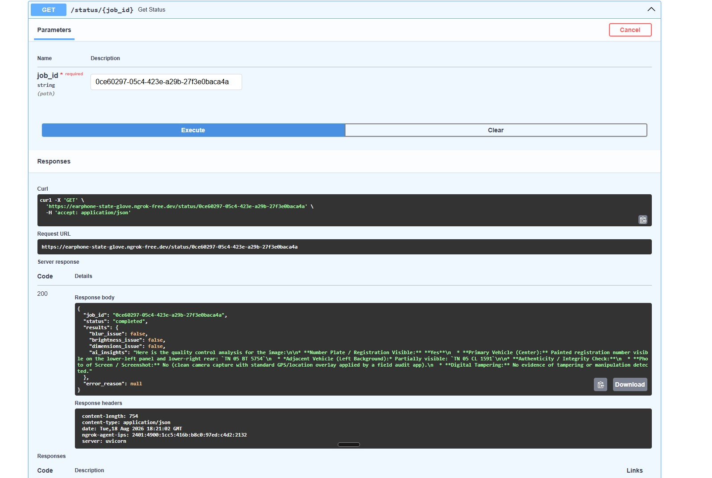
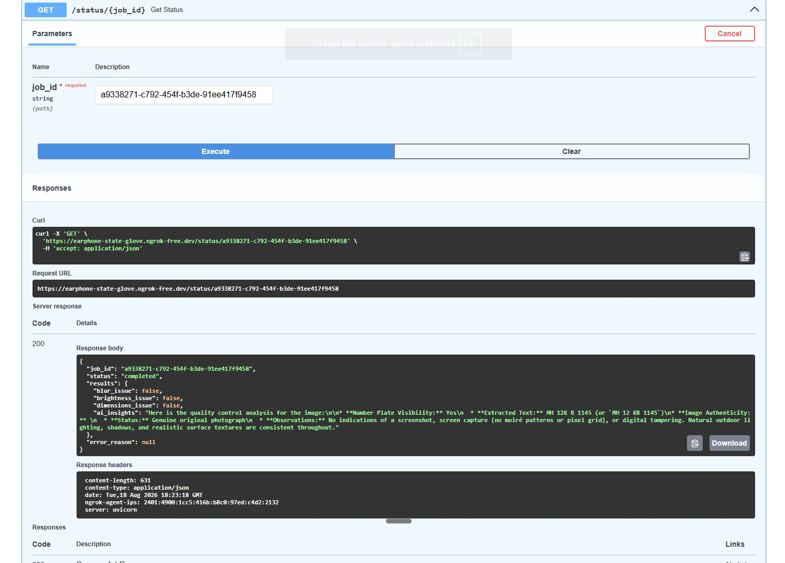

# Intelligent Media Processing Pipeline

A robust, asynchronous backend system designed to ingest, process, and analyze vehicle images from the field. This pipeline utilizes a background worker architecture to perform automated quality control and metadata extraction without blocking the main application thread.

## 🚀 Live Deployment PART
**☁️ Deployment Note:**
* **The Stack:** 4-tier architecture (FastAPI, Celery, PostgreSQL, Redis).
* **The Constraint:** Cloud providers do not offer free tiers for 24/7 background workers.
* **The Solution:** To avoid unnecessary costs for this assessment, the API is securely tunneled directly from my local environment.

---

## 🏗️ Architecture & System Design

This system is built with a strong focus on reliability, separation of concerns, and asynchronous task management.

*   **Service Flow:** The FastAPI application acts as the entry point. Upon receiving an image via `POST /upload`, it generates a UUID, saves the file locally, writes a `pending` state to the PostgreSQL database, and instantly delegates the processing job to the message queue. 
*   **Queue Strategy:** **Redis + Celery** was chosen for its industry-standard reliability. It decouples the web server from the computationally heavy analysis engine, ensuring that sudden spikes in image uploads do not degrade the API's response time or cause timeouts.
*   **Processing Flow:** A dedicated Celery worker continuously polls the Redis queue. Upon picking up a job, it executes 4 core checks (Blur, Brightness, Dimensions, and AI Heuristics), writes the JSON results back to the database, and transitions the state to `completed` or `failed`.
*   **Major Design Decisions:** 
    *   Used a definitive state machine (`pending` -> `processing` -> `completed`/`failed`) to allow clients to safely poll for status updates.
    *   Containerized the infrastructure (PostgreSQL & Redis) via Docker Compose for immediate, reliable local replication.

---

## 🤖 AI Usage Disclosure (Mandatory)

AI tools were utilized strategically to accelerate boilerplate generation and handle complex, unstructured image heuristics.

*   **Where I used AI:** 
    *   **Infrastructure Setup:** Used AI assistants to rapidly draft the `docker-compose.yml` configurations and FastAPI routing boilerplates.
    *   **Image Analysis Engine:** Integrated the Google Generative AI SDK (`gemini-flash-latest`) to evaluate image authenticity (detecting screen captures/tampering) and perform OCR on vehicle number plates.
*   **What AI helped with:** It allowed the system to perform complex visual anomaly detection without the massive time overhead of training custom OpenCV or ML models from scratch.
*   **Where AI output was wrong:** The generative AI assistant initially suggested using deprecated model nomenclature (e.g., `gemini-1.5-flash`), which resulted in `404 Not Found` API errors during processing.
*   **How I validated AI-generated code:** The API versioning issue was debugged by writing a standalone Python script to query the `genai.list_models()` method directly. This revealed the active model registry and allowed for a graceful update to the supported namespace. All background task states were manually validated end-to-end via the Swagger UI.

---

## ⚖️ Trade-offs & Future Improvements

To deliver a functional MVP within the 48-hour window, several intentional simplifications were made:

*   **Storage:** Images are currently stored on the local file system. **Improvement:** In a production environment, storage must be migrated to an AWS S3 bucket (or similar object storage), storing only the CDN URLs in the database to ensure stateless scalability.
*   **Scalability & Failure Handling:** A single Redis instance is used, and error handling relies on basic try/catch blocks. **Improvement:** Implement Dead-Letter Queues (DLQs) and automated Celery retry mechanisms with exponential backoff to handle transient third-party API failures.
*   **Client Polling:** The client currently must poll the `GET /status` API. **Improvement:** Implement WebSockets or Webhooks to push the completed JSON payload to the client immediately upon completion.
*   **Security:** Rate limiting and API key authentication on the `/upload` endpoint were omitted for ease of testing, but are mandatory for a production release.

---

## 📌 Assumptions Made
*   Uploaded images are in standard formats (JPG, PNG) and are reasonably sized (e.g., under 15MB) for a standard field-upload scenario.
*   The immediate goal is highly accurate heuristics over sub-second latency, justifying the use of third-party Generative AI APIs over purely local OpenCV math.

---

## ⚙️ Running Instructions

### Prerequisites
*   [Docker](https://www.docker.com/) and Docker Compose
*   Python 3.13+

### 1. Start Infrastructure
Spin up the PostgreSQL database and Redis message broker:
```bash
docker-compose up -d
```

### 2. Environment Setup
Create a virtual environment and install dependencies:
```bash
python -m venv venv
# Activate the environment (Windows: venv\Scripts\activate | Mac/Linux: source venv/bin/activate)
pip install -r requirements.txt
```
Create a `.env` file in the project root and add your Google Gemini API key:
```text
GEMINI_API_KEY=your_actual_key_here
```

### 3. Run the Services
You will need two terminal windows running simultaneously.

**Terminal 1 (Web Server):**
```bash
uvicorn main:app --reload
```

**Terminal 2 (Background Worker):**
```bash
celery -A worker.celery_app worker --loglevel=info --pool=solo
```
Navigate to `http://127.0.0.1:8000/docs` in your browser to test the endpoints.

---

## 📊 Sample Outputs (Test Cases)

Below are the successful pipeline executions for the three required sample images:

### Test Case 1: Image_1.jpg


### Test Case 2: Image_2.jpg


### Test Case 3: Image_3.jpg

